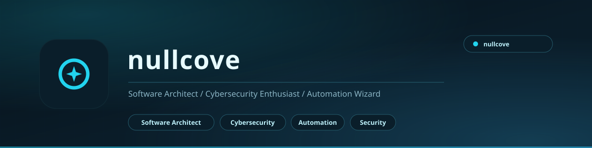

<picture>
  <source media="(prefers-color-scheme: light)" srcset="docs/assets/banner-light.svg">
  <source media="(prefers-color-scheme: dark)" srcset="docs/assets/banner.svg">
  
</picture>

 

**nullcove**

The name I keep for the security and automation side of the work.

 

---

## What this is

A home for the nullcove identity - the banner, the project index, and the automation that keeps the profile graphics on my GitHub page current.

The work itself lives in my main account: **[github.com/aizenrexx](https://github.com/aizenrexx)**.

---

## What I work on

| Area | What that means in practice |
|:---|:---|
| **Windows tooling** | Native C# and .NET applications - a search engine that reads the NTFS Master File Table directly, a folder switcher that journals every write |
| **Security** | Password managers, secrets handling, and building things so they fail loudly instead of silently |
| **Automation** | Scripts and pipelines that remove the manual step, with a log of what they did |
| **Full-stack** | React and Next.js over Express and PostgreSQL, wired end to end |

---

## Projects

| Project | What it is |
|:---|:---|
| [**AizenRex Search-man**](https://github.com/aizenrexx/AizenRex-Search-man) | Ultra-fast native Windows file search built on the NTFS Master File Table |
| [**AizenRex Steam Switcher**](https://github.com/aizenrexx/AizenRex-Steam-Switcher) | Manage two Steam installations and switch between them safely |
| [**Link Haven**](https://github.com/aizenrexx/link-haven) | Full-stack bookmark manager with AI search and a command palette |
| [**Proton Pass**](https://github.com/aizenrexx/proton-pass) | Full-featured password manager clone with a security centre |
| [**Smart Ins-Note**](https://github.com/aizenrexx/smart-ins-note) | Notes app with an AI assistant and persistent memory |
| [**Amar Hisab**](https://github.com/aizenrexx/ledger-knox) | Personal accounting and expense tracker |

---

## The contribution graph

The animated contribution snake below is generated by a scheduled workflow in this repository and published to the `output` branch, so it stays current without anyone touching it.

<picture>
  <source media="(prefers-color-scheme: light)" srcset="https://raw.githubusercontent.com/aizenrexx/nullcove/output/github-contribution-grid-snake.svg">
  <source media="(prefers-color-scheme: dark)" srcset="https://raw.githubusercontent.com/aizenrexx/nullcove/output/github-contribution-grid-snake-dark.svg">
  
</picture>

---

## Contact

|  |  |
|:---|:---|
| **Main account** | [github.com/aizenrexx](https://github.com/aizenrexx) |
| **Also known as** | Aizenrex x Riyad |
| **Based in** | Dhaka, Bangladesh |

 

<i>Build it so it survives the crash.</i>

